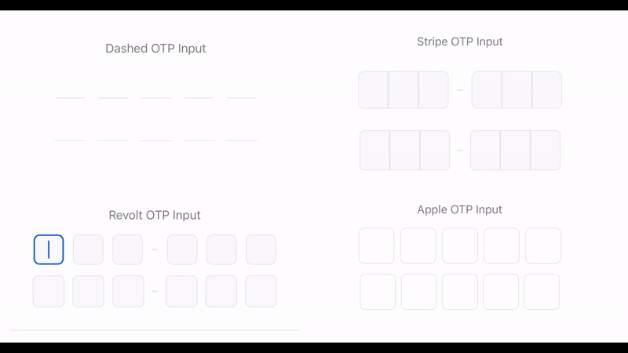

<p align="center">
    
</p>
<h1 align="center">
Input OTP Native 🔐
</h1>
<p align="center">
✨ One time passcode Input For React Native/Expo. Unstyled and fully customizable. ✨
</p>

<p align="center">
<a href="https://github.com/yjose/input-otp-native/actions/workflows/ci.yml"></a>
  <a href="https://www.npmjs.com/package/input-otp-native"></a>
  <a href="http://www.npmtrends.com/input-otp-native"></a>
  <a href="https://github.com/yjose/input-otp-native/blob/master/LICENSE"></a>
  <a href="https://github.com/yjose/input-otp-native/stargazers"></a>

</p>

<hr/>

## Features

- 📱 Built specifically for React Native/Expo
- 🎨 Fully customizable styling with render props ( supports nativewind )
- 📋 Four copy paste styles (Apple, Stripe, Revolt, Dashed)
- 🧪 100% test coverage
- 🔄 Easily animated with react-native-reanimated
- 🌐 Web support with using `otp-input`

```sh
## npm
npm install input-otp-native

## yarn
yarn add input-otp-native

#pnpm
pnpm add input-otp-native
```

## Full Documentation

[Homepage](https://input-otp-native.better-app.dev)
[Getting Started](https://input-otp-native.better-app.dev/getting-started)
[Examples](https://input-otp-native.better-app.dev/examples)

## Examples

We create a few examples that you can copy paste and use in your project.

💳 [Stripe OTP Input with Nativewind](./example/src/examples/stripe-nativewind.tsx)

```tsx
import { View, Text } from 'react-native';
import { OTPInput, type SlotProps } from 'input-otp-native';
import type { OTPInputRef } from 'input-otp-native';
import { useRef } from 'react';
import { Alert } from 'react-native';

import Animated, {
  useAnimatedStyle,
  withRepeat,
  withTiming,
  withSequence,
  useSharedValue,
} from 'react-native-reanimated';
import { useEffect } from 'react';
import { cn } from './utils';

export default function StripeOTPInput() {
  const ref = useRef<OTPInputRef>(null);
  const onComplete = (code: string) => {
    Alert.alert('Completed with code:', code);
    ref.current?.clear();
  };

  return (
    <OTPInput
      ref={ref}
      onComplete={onComplete}
      maxLength={6}
      render={({ slots }) => (
        <View className="flex-1 flex-row items-center justify-center my-4">
          <View className="flex-row">
            {slots.slice(0, 3).map((slot, idx) => (
              <Slot key={idx} {...slot} index={idx} />
            ))}
          </View>
          <FakeDash />
          <View className="flex-row">
            {slots.slice(3).map((slot, idx) => (
              <Slot key={idx} {...slot} index={idx} />
            ))}
          </View>
        </View>
      )}
    />
  );
}

function Slot({
  char,
  isActive,
  hasFakeCaret,
  index,
}: SlotProps & { index: number }) {
  const isFirst = index === 0;
  const isLast = index === 2;
  return (
    <View
      className={cn(
        `w-12 h-16 items-center justify-center bg-gray-50`,
        'border border-gray-200',
        {
          'rounded-r-lg': isLast,
          'rounded-l-lg': isFirst,
          'bg-white border-black': isActive,
        }
      )}
    >
      {char !== null && (
        <Text className="text-2xl font-medium text-gray-900">{char}</Text>
      )}
      {hasFakeCaret && <FakeCaret />}
    </View>
  );
}

function FakeDash() {
  return (
    <View className="w-8 items-center justify-center">
      <View className="w-2 h-0.5 bg-gray-200 rounded-sm" />
    </View>
  );
}

function FakeCaret() {
  const opacity = useSharedValue(1);

  useEffect(() => {
    opacity.value = withRepeat(
      withSequence(
        withTiming(0, { duration: 500 }),
        withTiming(1, { duration: 500 })
      ),
      -1,
      true
    );
  }, [opacity]);

  const animatedStyle = useAnimatedStyle(() => ({
    opacity: opacity.value,
  }));

  const baseStyle = {
    width: 2,
    height: 32,
    backgroundColor: 'black',
    borderRadius: 1,
  };

  return (
    <View className="absolute w-full h-full items-center justify-center">
      <Animated.View style={[baseStyle, animatedStyle]} />
    </View>
  );
}
```

💳 [Stripe OTP Input](./example/src/examples/stripe.tsx)

```tsx
import { View, Text, StyleSheet, type ViewStyle, Alert } from 'react-native';
import { OTPInput, type SlotProps } from 'input-otp-native';
import type { OTPInputRef } from 'input-otp-native';
import { useRef } from 'react';

import Animated, {
  useAnimatedStyle,
  withRepeat,
  withTiming,
  withSequence,
  useSharedValue,
} from 'react-native-reanimated';
import { useEffect } from 'react';

export default function StripeOTPInput() {
  const ref = useRef<OTPInputRef>(null);
  const onComplete = (code: string) => {
    Alert.alert('Completed with code:', code);
    ref.current?.clear();
  };

  return (
    <OTPInput
      ref={ref}
      onComplete={onComplete}
      maxLength={6}
      render={({ slots }) => (
        <View style={styles.mainContainer}>
          <View style={styles.slotsContainer}>
            {slots.slice(0, 3).map((slot, idx) => (
              <Slot key={idx} {...slot} index={idx} />
            ))}
          </View>
          <FakeDash />
          <View style={styles.slotsContainer}>
            {slots.slice(3).map((slot, idx) => (
              <Slot key={idx} {...slot} index={idx} />
            ))}
          </View>
        </View>
      )}
    />
  );
}

function Slot({
  char,
  isActive,
  hasFakeCaret,
  index,
}: SlotProps & { index: number }) {
  const isFirst = index === 0;
  const isLast = index === 2;

  return (
    <View
      style={[
        styles.slot,
        isFirst && styles.slotFirst,
        isLast && styles.slotLast,
        isActive && styles.activeSlot,
      ]}
    >
      {char !== null && <Text style={styles.char}>{char}</Text>}
      {hasFakeCaret && <FakeCaret />}
    </View>
  );
}

function FakeDash() {
  return (
    <View style={styles.fakeDashContainer}>
      <View style={styles.fakeDash} />
    </View>
  );
}

function FakeCaret({ style }: { style?: ViewStyle }) {
  const opacity = useSharedValue(1);

  useEffect(() => {
    opacity.value = withRepeat(
      withSequence(
        withTiming(0, { duration: 500 }),
        withTiming(1, { duration: 500 })
      ),
      -1,
      true
    );
  }, [opacity]);

  const animatedStyle = useAnimatedStyle(() => ({
    opacity: opacity.value,
  }));

  return (
    <View style={styles.fakeCaretContainer}>
      <Animated.View style={[styles.fakeCaret, style, animatedStyle]} />
    </View>
  );
}

const styles = StyleSheet.create({
  mainContainer: {
    flex: 1,
    flexDirection: 'row',
    alignItems: 'center',
    justifyContent: 'center',
    marginVertical: 16,
  },
  slotsContainer: {
    flexDirection: 'row',
  },
  slot: {
    width: 42,
    height: 52,
    alignItems: 'center',
    justifyContent: 'center',
    backgroundColor: '#F9FAFB',
    borderWidth: 1,
    borderColor: '#E5E7EB',
  },
  slotFirst: {
    borderTopLeftRadius: 8,
    borderBottomLeftRadius: 8,
  },
  slotLast: {
    borderTopRightRadius: 8,
    borderBottomRightRadius: 8,
  },
  activeSlot: {
    backgroundColor: '#FFF',
    borderColor: '#000',
  },
  char: {
    fontSize: 22,
    fontWeight: '500',
    color: '#111827',
  },
  fakeDashContainer: {
    width: 32,
    alignItems: 'center',
    justifyContent: 'center',
  },
  fakeDash: {
    width: 8,
    height: 2,
    backgroundColor: '#E5E7EB',
    borderRadius: 1,
  },
  /* Caret */
  fakeCaretContainer: {
    position: 'absolute',
    width: '100%',
    height: '100%',
    alignItems: 'center',
    justifyContent: 'center',
  },
  fakeCaret: {
    width: 2,
    height: 32,
    backgroundColor: '#000',
    borderRadius: 1,
  },
});
```

🍏 [Apple OTP Input with Nativewind](./example/src/examples/apple-nativewind.tsx)

🍎 [Apple OTP Input](./example/src/examples/apple.tsx)

🔄 [Revolt OTP Input](./example/src/examples/revolt.tsx)

🔄 [Revolt OTP Input with Nativewind](./example/src/examples/revolt-nativewind.tsx)

〰️ [Dashed OTP Input](./example/src/examples/dashed.tsx)

〰️ [Dashed OTP Input with Nativewind](./example/src/examples/dashed-nativewind.tsx)

## API Reference

### OTPInput Props

| Prop               | Type                              | Default   | Description                         |
| ------------------ | --------------------------------- | --------- | ----------------------------------- |
| `maxLength`        | number                            | Required  | Number of OTP digits                |
| `render`           | (props: RenderProps) => ReactNode | Required  | Render function for OTP slots       |
| `value`            | string                            | undefined | Controlled value of the input       |
| `onChange`         | (value: string) => void           | undefined | Callback when value changes         |
| `onComplete`       | (value: string) => void           | undefined | Callback when all digits are filled |
| `containerStyle`   | ViewStyle                         | undefined | Style for the container             |
| `pattern`          | string                            | undefined | Regex pattern for input validation  |
| `textAlign`        | 'left' \| 'center' \| 'right'     | 'left'    | Text alignment within input         |
| `pasteTransformer` | (pasted: string) => string        | undefined | Transform pasted text               |

### RenderProps

| Prop        | Type        | Description                     |
| ----------- | ----------- | ------------------------------- |
| `slots`     | SlotProps[] | Array of slot objects to render |
| `isFocused` | boolean     | Whether the input is focused    |

### SlotProps

| Prop              | Type           | Description                |
| ----------------- | -------------- | -------------------------- |
| `char`            | string \| null | Character in the slot      |
| `isActive`        | boolean        | Whether the slot is active |
| `hasFakeCaret`    | boolean        | Whether to show fake caret |
| `placeholderChar` | string \| null | Placeholder character      |

## Web support

The library is mainly inspired by [otp-input](https://github.com/guilhermerodz/input-otp) and has a similar API, so we recommend using it on the web.

We can easily create the same component for web and create a new file for it (example/src/examples/apple.web.tsx)

## Contributing

See the [contributing guide](CONTRIBUTING.md) to learn how to contribute to the repository and the development workflow.

## License

MIT

---

## Credits

- [create-react-native-library](https://github.com/callstack/react-native-builder-bob) for the library template.

- [otp-input](https://github.com/guilhermerodz/input-otp) for the original idea and some code.
